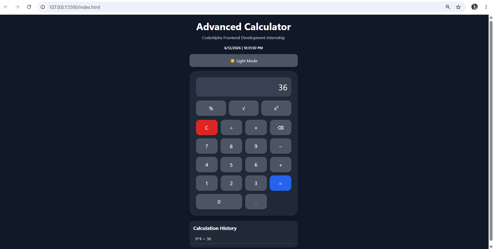
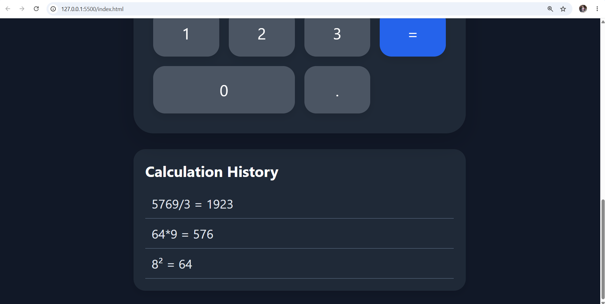
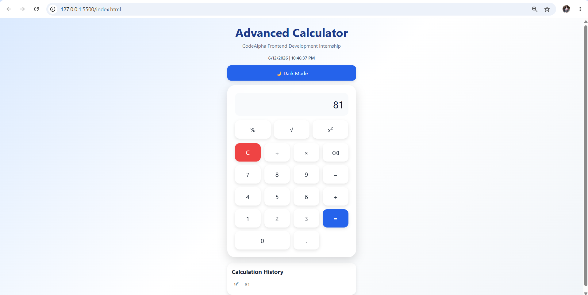

🔢 Advanced Calculator Web App

A modern and responsive calculator web application built using **HTML, CSS, and JavaScript** as part of the **CodeAlpha Frontend Development Internship**.

🚀 Features

### Basic Calculator Functions

* Addition (+)
* Subtraction (-)
* Multiplication (×)
* Division (÷)
* Clear Screen (C)
* Delete Last Character (⌫)

### Scientific Functions

* Percentage (%)
* Square Root (√)
* Square (x²)

### Advanced Features

* Real-Time Date & Time
* Dark / Light Theme Toggle
* Calculation History Panel
* Keyboard Support
* Button Click Sound Effect
* Responsive Design
* Modern Glassmorphism UI
* Hover Animations

## 🛠️ Technologies Used

* HTML5
* CSS3
* JavaScript (ES6)

## 📁 Project Structure

```text
CodeAlpha_Calculator/
│
├── index.html
├── style.css
├── script.js
├── click.mp3
├── README.md
│
└── Screenshot/
    ├── light-mode.png
    ├── dark-mode.png
    ├── history.png
    └── scientific.png
```

## 📸 Screenshots

### Light Mode


### Dark Mode



### Calculation History



### Scientific Functions



## 🎯 Internship Task

**Task 2: Build a Calculator**

Completed as part of the **CodeAlpha Frontend Development Internship Program**.

## 👨‍💻 Author

**Snehal Sutar**

GitHub: https://github.com/snehalsutar090804-a11y

## ⭐ Future Improvements

* Memory Functions (M+, M-, MR)
* Advanced Scientific Calculator
* Currency Converter
* Unit Converter
* Calculation Export Feature
